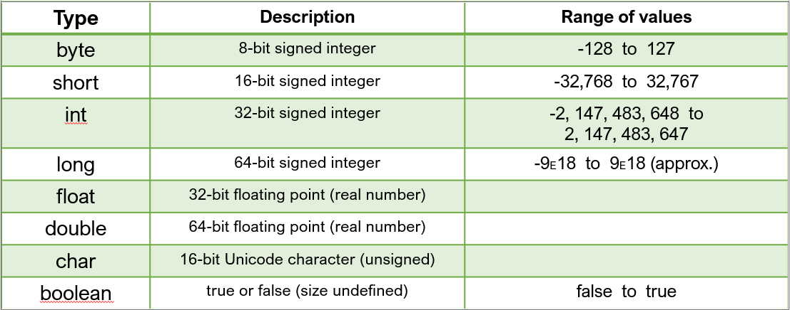

# Chapter 2
## _Variables and Loops_

## Variables
In Java, variables have types
The type defines what messages can be passed to the variable
You cannot assign a value of one type to a variable of another type

Once a variable has been declared, we must assign it a value
String myString;			   	Declaration
myString = “Hello, world!”;   		Assignment
Until a variable has been assigned a value, it is useless
You can combine a declaration and an assignment into one statement, called an initialization
String myString = “Hello world!”;   	Initialization


Variables and assignments are independent:
	String str1 = “Hello”;
	String str2 = str1;
	str1 = “Goodbye”;
	System.out.println(str2);	// ???


Constants (or literals) are not variables
	String str;
	“Hello” = str;	// INVALID!!
	
	Variables only hold one value at a time:
	String str1 = “Hello”;
	String str2 = “Goodbye”;
	str1 = str2;
	str2 = str1;
	System.out.println(str1);	// ???
	System.out.println(str2);	// ???

Variables only hold one value at a time:
	String str1 = “Hello”;
	String str2 = “Goodbye”;
	String temp;
	temp = str1;
	str1 = str2;
	str2 = temp;
	System.out.println(str1);	// ???
	System.out.println(str2);	// ???

Integers are represented in Java by the int type
int is one of several primitive types in Java
For the most part, primitives are just like other types
Primitives cannot  have messages passed to them!
	int x = 5;
	x.add(4);	// invalid

All four basic arithmetic operations exist in Java as operators:
Addition: +
Subtraction: -
Multiplication: *
Division: /
There is also the modulo (remainder) operator:
Modulo: %

Each arithmetic operator must be applied to exactly two arguments (just like normal arithmetic):
	int x = 4 + 7;
	int y = x * 3;
These operations can be strung together:
	int z = x / 2 – y;
The normal arithmetic order of operations is followed (including parentheses):
	int a = 3 + 4 * 5;	// ???
	int b = (5 – 1) / 2;	// ???
	int c = 15 – 7 % 3;	// ??? 

Example for 673 % 10:
Divide 673 by 10 = 67
The remainder (left over is 3)
Can calculate it by: 673 – (673 / 10 * 10)=673-670=3
Or, for a number n % m:    n – (n/m * m)
Example: 34 % 3:
34 – (34/3 * 3)  = 34 – (11*3) = 34-33 = 1

Real numbers are represented in Java using the double type
ex: double f = 78.2;
Arithmetic on doubles is the same as on ints, with two exceptions:
Division is real number division
The modulo operator (%) is a little strange


## Statements VS Expressions

A statement is a complete snippet of code that can be executed
Statements are terminated by semi-colons
A statement may or may not represent a value
An expression is something that has a value, including:
Literals
Variables
Results of operators
Some method calls


## More on Primitives
So far, we have seen two primitive types (int and double)
Here’s the full list of primitive types:
 
 
 int, short, and byte values are all simple integers:
int i = 40000;
short s = 1000;
byte b = 100;

long values require an ‘L’ to be appended:
long l = 3000000000L;

floats require appending an ‘f’:
float f = 3.1415927f;

doubles have an optional appended ‘d’:
double d1 = 2.718281828d;
double d2 = 1.414;

chars are enclosed in single quotes:
char c1 = ‘a’;
char c2 = ‘5’;
Note that this is very different from int i = 5;
char c3 = ‘ ’;
Certain special chars require an escape sequence (just like in strings):
char c4 = ‘\n’;
char c5 = ‘\0’;
char c6 = ‘\\’;
char c7 = ‘\’’;

true and false are the only boolean values, and are reserved words:
boolean b1 = true;
boolean b2 = false;
The result of a Boolean expression is also a boolean value:
boolean b3 = x < 5;
boolean b4 = (y > 6) && (z == 7);
boolean b5 = str.equals(“Hello!”);
boolean b6 = (5 > y) || true;


## Type Conversion


Some primitive types can be implicitly converted to one another:
  int i = 10;
  long l = i;
Others require a explicit conversion, called a cast:
  double d = 5.0;
  int i2 = (int)d;
  char c = (char) i2;
  
Widening conversion takes place when two data types are automatically converted. This happens when:  
The two data types are compatible.
When we assign a value of a smaller data type to a bigger data type.


```
public static void wideningConversion(){
        int i = 100;
        long l = i;
	float f = l;
        System.out.println("Int value "+i);
        System.out.println("Long value "+l);
        System.out.println("Float value "+f);
    }

```

While evaluating expressions, the intermediate value may exceed the range of operands and hence the expression value will be promoted. 
Some conditions for type promotion are:  
Java automatically promotes each byte, short, or char operand to int when evaluating an expression.
If one operand is long, float or double the whole expression is promoted to long, float or double respectively.
Java promotes chars to ASCII values


```
public static void simpleTypeConversion(){
        char c = 'A';
        int i = 100;
        double result = i + c;
        System.out.println("result = " + result);
    }

```

Frequently in programming, we want to do something like this:
	price = price * 1.09;	// apply tax
	price = price + 2.95;	// add shipping
	price = price – 5.00;	// apply coupon
Because this is so common, Java gives us a shortcut for this kind of operation:
	price *= 1.09;	// apply tax
	price += 2.95;	// add shipping
	price -= 5.00;	// apply coupon

These operators are called compound assignment operators
There is a compound assignment operator corresponding to each arithmetic operator:
```
These operators are called compound assignment operators
There is a compound assignment operator corresponding to each arithmetic operator:
+    +=
-    -=
*    *=
/    /=
%    %=
Since these are assignments, only variables can be on the left-hand side
Any expression of the correct type can go on the right-hand side

```

Even more common are these operations:
	x = x + 1;
	x = x – 1;

How could we rewrite these using compound assignment?
	x += 1;
	x -= 1;

Java let’s us shortcut these operations even further with the increment and decrement operators:
	x++;
	x--;

These are called postfix operators, because the operator comes after the operand
There are also prefix versions of these (++x, --x)
For now, assume the prefix and postfix versions are the same, and prefer the postfix version

As with compound assignment, only variables can be the operand
(x + 3)++;	// invalid
7--;		// invalid

http://carlcheo.com/compsci
Helpful link ^


## For Loops

We have loops to help us repeat code
The simplest type of loop is the for loop

```
for (<initialization>; <condition>; <update>) 
{
   <statement>
   <statement>
   …
   <statement>
}

```

The initialization is usually just that (but doesn’t have to be).
The update is usually an assignment, and often a compound assignment.
Most common form: counting loop:

```
for (int i = 0; i < n; i++) 
   {
	   <some operation>
	}

```

Order of execution:
Execute initialization
Test condition
If condition is false, skip to step 7
Execute the body of the loop
Execute the update
Return to step 2 (iterate)
Continue with the statement after the body of the loop (terminate)

Technically, only the condition is necessary in the for loop itself:
	int i = 0;
	for (; i < n; ) 
    {
	   <some operation>
	   i++;
	}

Notice that the semi-colons are still required
NOTE: Don’t use this form of a for loop!


When we place a loop in the body of another loop, it is called a nested loop

```
for (int row = 0; row < 5; row++) 
{
    for (int col = 0; col < 10; col++) 
    {
         System.out.print("*");
    }
    System.out.println(); // to end the line
}

```

In the previous example, the outer loops runs 5 times
The inner loop runs 10 times for each time the outer loop runs
So how many total?
Notice the variables!

A magic number in a computer program is a number that appears without context
Magic numbers are BAD
Poor readability
Error-prone on changes
What could we do instead?

#### Scope and Class Constants

A variable could work, but…
```
public static void main(String[] args) 
{
    int size = 5;
    printLabels();
    print Table();
}

public static void printLabels() 
{
    for (int i = 0; i < size; i++) 
    {
    ...
	  }
}

public static void printTable() 
{
    for (int i = 0; i < size; i++) 
    {
    ...
    }
}
```
We can avoid our scope problems with a class constant
public static final <type> <name> = <value>;
Example: public static final int TABLE_SIZE = 5;
A class constant is declared outside any method so it's scope is the entire program
We should ONLY do this with constants (for now)

A constant is a variable whose value cannot be changed once it is assigned
By convention, name is all upper case, separated by underscore
To scale program, we then just change value of constant

Break down the problem into pieces you can solve
Try out very small things
Test an object to see how it works
Write a simple loop or if statement to try it out
Now add a little bit at a time and run it again
Code a bit -> Run it/check it -> Fix it -> Repeat


  
